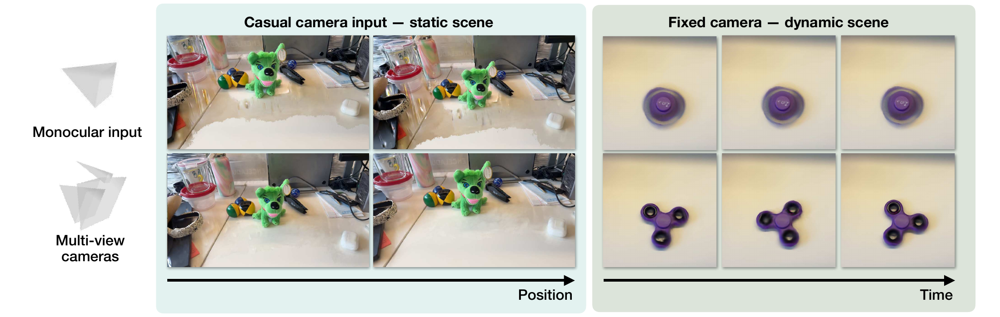

# Sparse Light Field Sampling Improves Casual 3D and 4D Reconstruction

[Shamus Li](https://shamus.li)<sup>1</sup>,
[Ruiming Cao](https://rmcao.net/)<sup>2</sup>,
[Laura Waller](https://www.laurawaller.com/)<sup>3</sup>,
[Kristina Monakhova](https://kristinamonakhova.com/)<sup>1</sup>,
[Sara Fridovich-Keil](https://sarafridov.github.io/)<sup>4</sup>

<sup>1</sup>Cornell University · <sup>2</sup>Adobe · <sup>3</sup>UC Berkeley ·
<sup>4</sup>Georgia Tech

[Project page](https://shamus.li/lightfield-gaussian-splatting/)



Many consumer smartphones, stereo cameras, and light field cameras record multiple synchronized viewpoints in a single exposure event. However, novel view synthesis pipelines commonly use only a monocular stream and rely on camera motion or learned priors to obtain angular coverage. In this paper, we ask: why do we use only one viewpoint? We analyze *sensor-limited multi-view*, where one sensor trades off spatial and angular resolution, and *exposure-limited multi-view*, where multiple sensors on one commodity device observe each event simultaneously. We introduce a new dataset incorporating three types of commodity multi-view cameras, and evaluate sparse-view 3DGS and 4DGS baselines measuring reconstruction quality as a function of number of exposures and angle between extreme views. Our results demonstrate that using multiple cameras—even with a low baseline—significantly improves reconstruction quality in single-shot, few-shot, and casual video settings. In addition, under a fixed sensor budget, angular sampling improves reconstruction when exposures are scarce despite lower spatial resolution. The gains are most pronounced for single-shot and dynamic scenes, where a stationary monocular camera lacks the angular diversity to recover scene geometry and motion.

## Installation

We used Linux with CUDA 12.8.

```bash
git clone --recursive https://github.com/shamus-li/lightfield-gaussian-splatting.git
cd lightfield-gaussian-splatting
uv sync
```

To run other results, you can install additional environments:
```bash
./setup.sh vggt       # static data preprocessing
./setup.sh dynamic    # dynamic reconstruction
./setup.sh difix      # Difix3D+
./setup.sh fsgs       # FSGS baseline
./setup.sh sparsegs   # SparseGS baseline
```

## Data

We collect and release two real-world datasets comprising 16 scenes (8 static, 8 dynamic), along with rendered inputs for the synthetic experiments. Download the [public dataset folder](https://drive.google.com/drive/folders/1D68RDdv5NK0_aY1kH_39CO9IjxuJBWja?usp=sharing) and extract its contents into `data/`.

```text
data/
├── casual/<scene>/
│   ├── iphone-train/
│   ├── iphone-eval/
│   ├── stereo-train/
│   ├── stereo-eval/
│   └── static/
│       ├── wide.png
│       ├── tele.png
│       ├── ultrawide.png
│       ├── stereo_left.png
│       ├── stereo_right.png
│       └── lightfield/inner_02/images/
├── dynamic/<scene>/
│   ├── iphone/
│   └── stereo/
├── multiplexed/
│   ├── images/
│   ├── masks/
│   └── sparse/
└── synthetic/
    ├── blender/<scene>.blend
    └── <scene>/
        ├── transforms_train.json
        ├── transforms_test.json
        └── <camera>/<exposures>views/train/
            ├── transforms_train.json
            └── *.png
```

## Running the code

Prepare and train a real static scene:

```bash
uv run python train.py prepare-static \
  --data data/casual/action-figure

uv run python train.py static \
  --data data/casual/action-figure \
  --result-dir outputs/action-figure-stereo \
  --camera-model stereo
```

Train on a casual video capture:

```bash
uv run python train.py casual \
  --data data/casual/action-figure \
  --result-dir outputs/action-figure-iphone
```

Train on a dynamic capture:

```bash
uv run python train.py dynamic \
  --data data/dynamic/scissors \
  --result-dir outputs/scissors-stereo \
  --modality stereo
```

Train on a synthetic scene:

```bash
uv run python train.py synthetic \
  --data data/synthetic/drums \
  --result-dir outputs/drums-stereo \
  --camera-model stereo \
  --num-exposures 3
```

Train on the multiplexed capture:

```bash
uv run python train.py multiplexed \
  --data data/multiplexed \
  --result-dir outputs/multiplexed
```

Prepare and train for depth rendering:

```bash
uv run python train.py prepare-depth \
  --data data/synthetic/drums

uv run python train.py depth \
  --data data/synthetic/drums \
  --result-dir outputs/drums-stereo
```

Training commands render and evaluate the final model. Pass `--eval` to recompute evaluation for an existing result directory.

## Citation

```bibtex
@inproceedings{li2026sparse,
  title     = {Sparse Light Field Sampling Improves Casual 3D and 4D Reconstruction},
  author    = {Li, Shamus and Cao, Ruiming and Waller, Laura and Monakhova, Kristina and Fridovich-Keil, Sara},
  booktitle = {European Conference on Computer Vision Workshops},
  year      = {2026}
}
```
